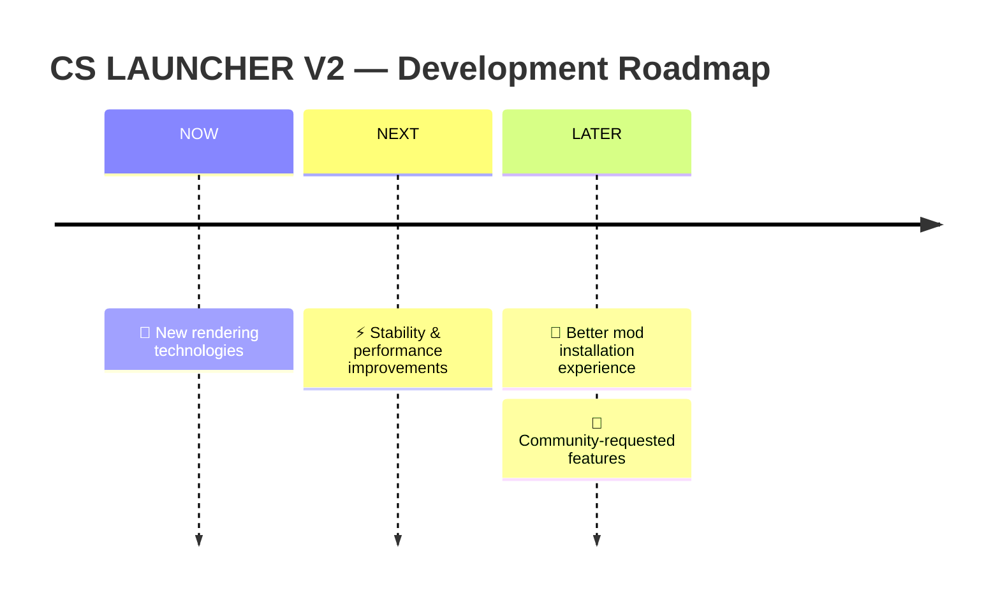

<div align="center">

<!-- 🎬 Animated Header -->


<!-- ⌨️ Animated Typing Tagline -->


<br><br>

<p>
  
  
  
  
</p>

<p>
  <a href="#"></a>
  <a href="https://example.com"></a>
</p>

<h3>
  <a href="#-download">📥 Download</a>
  <span> · </span>
  <a href="#-quick-start">🚀 Quick Start</a>
  <span> · </span>
  <a href="#-features">✨ Features</a>
  <span> · </span>
  <a href="#-faq">❓ FAQ</a>
  <span> · </span>
  <a href="#-support">💬 Support</a>
</h3>


</div>

> 🎮 **CS LAUNCHER V2** is a powerful Minecraft: Java Edition launcher for Android, forked from [Amethyst](https://github.com/AngelAuraMC/Amethyst-Android) and built on the legendary foundations of [Boardwalk](https://github.com/zhuowei/Boardwalk) and [PojavLauncher](https://github.com/PojavLauncherTeam/PojavLauncher).

<br>

## ✨ Features

<div align="center">

| | Feature | Description |
|:---:|:---|:---|
| 🎮 | **Every Version** | From `rd-132211` to the latest `1.21` snapshots — including Combat Tests |
| 🧩 | **Mod Support** | Full **Forge** & **Fabric** modding support |
| 🎨 | **Modern UI** | Completely redesigned, sleek user interface |
| ⚡ | **Multi-Renderer** | GL4ES, ANGLE, MobileGlues, virglrenderer & more |
| 🎛️ | **Custom Controls** | Fully customizable on-screen controls & gamepad support |
| 🌍 | **Multi-Language** | Community translations via Crowdin |
| 📱 | **Wide Support** | Android 8.0+ (minSdk 26), all major architectures |

</div>

<br>

## 📱 Requirements

| Component | Minimum | Recommended |
|:---|:---|:---|
| **Android** | 8.0 (API 26) | 10.0+ |
| **RAM** | 2 GB | 4 GB+ |
| **Storage** | 1 GB free | 4 GB+ free |
| **Account** | — | Microsoft account for online play |

<br>

## 📥 Download

<div align="center">

| Channel | Stability | Best For |
|:---:|:---:|:---|
| 🚀 **Releases** | ✅ Stable | Most users — prebuilt, tested APKs |
| 🌙 **Nightly** | ⚠️ Experimental | Testers who want the newest features first |
| 🔧 **Source** | 🛠️ DIY | Developers — see [Building](#%EF%B8%8F-building-from-source) |

</div>

<br>

## 🚀 Quick Start

1. 📥 **Download** the latest APK from Releases
2. 📲 **Install** it (allow "Install from unknown sources" if asked)
3. 🔑 **Sign in** with your Microsoft account (or play in offline mode)
4. 🎮 **Pick a version**, hit **Play**, and enjoy Minecraft on Android!

<br>

## 📸 Screenshots

<!-- TODO: Add your screenshots here -->
<div align="center">

| Launcher UI | In-Game | Settings |
|:---:|:---:|:---:|
| 🖼️ *coming soon* | 🖼️ *coming soon* | 🖼️ *coming soon* |

</div>

<br>

## 🛠️ Building from Source

### ⚡ Quick Build (Recommended)

```bash
# 1️⃣ Clone the repository (with submodules)
git clone --recursive <YOUR_REPO_URL>
cd <YOUR_REPO_NAME>

# 2️⃣ Build the launcher (use gradlew.bat on Windows)
./gradlew :app_pojavlauncher:assembleDebug
```

> 📦 **Output:** `app_pojavlauncher/build/outputs/apk/debug/`

<details>
<summary>🔬 <b>Detailed Build Guide</b> — click to expand</summary>

<br>

#### 1️⃣ Java Runtime Environment (JRE)
Download the `jre8-pojav` artifact from AngelAuraMC's [CI auto builds](https://github.com/AngelAuraMC/openjdk-build-multiarch/actions) — pre-built JREs for all architectures. To build it yourself, follow [android-openjdk-build-multiarch](https://github.com/AngelAuraMC/openjdk-build-multiarch).

#### 2️⃣ LWJGL
Build instructions in the [LWJGL repository](https://github.com/AngelAuraMC/lwjgl3).

#### 3️⃣ Language List

**Linux/macOS:**
```bash
chmod +x scripts/languagelist_updater.sh
bash scripts/languagelist_updater.sh
```

**Windows:**
```batch
scripts\languagelist_updater.bat
```

#### 4️⃣ Build the GLFW stub
```bash
./gradlew :jre_lwjgl3glfw:build
```

#### 5️⃣ Build the launcher
```bash
./gradlew :app_pojavlauncher:assembleDebug
```

</details>

<br>

## 📊 Project Status

```text
██████████████████████ 100% Complete
```

| Task | Status |
|:---|:---:|
| 🎨 New UI | ✅ **Done** |
| 🐛 Bug fixes | ✅ **Done** |
| 🔧 Fix GL4ES & KW in older versions | ✅ **Done** |
| 🖼️ Add more renderers | ✅ **Done** |

<br>

## 🗺️ Roadmap

<div align="center">



</div>

💡 **Your feedback shapes the roadmap!** Open a feature request in the issue tracker.

<br>

## ❓ FAQ

<details>
<summary><b>Is CS LAUNCHER V2 free?</b></summary>
<br>
Yes! 100% free and open source. However, you need a legitimate Minecraft: Java Edition account for online play.
</details>

<details>
<summary><b>Which Minecraft versions are supported?</b></summary>
<br>
Almost all of them — from <code>rd-132211</code> all the way to the latest <code>1.21</code> snapshots, including Combat Test versions.
</details>

<details>
<summary><b>Can I use mods?</b></summary>
<br>
Yes! Both <b>Forge</b> and <b>Fabric</b> are supported. Install your favorite mod loader directly from the launcher.
</details>

<details>
<summary><b>The game crashes or runs slow. What can I do?</b></summary>
<br>
Try switching renderers in settings, lower the render distance, allocate more RAM, or ask for help on our Discord server.
</details>

<details>
<summary><b>Does it work on Android TV or tablets?</b></summary>
<br>
Yes, as long as the device runs Android 8.0+ — gamepad and keyboard/mouse input are supported too.
</details>

<br>

## 🐞 Known Issues

Check the **issue tracker** for known issues and their status. Found a new bug? Report it — every report makes the launcher better! 🙏

<br>

## 🤝 Contributing

<div align="center">

| 🐛 | 💡 | 🌍 | 🔀 |
|:---:|:---:|:---:|:---:|
| **Report Bugs** | **Suggest Features** | **Translate** | **Submit PRs** |
| via issue tracker | share your ideas | help localize | code with us |

</div>

<br>

## 💬 Support

<div align="center">

<a href="#"></a>
&nbsp;
<a href="https://example.com"></a>

<!-- TODO: Replace Discord (#) and Website (example.com) links -->

</div>

<br>

## 📜 License

**CS LAUNCHER V2** is licensed under the **GNU GPL v3.0**.
See the LICENSE file for details.

<br>

## 🙏 Credits & Dependencies

<details>
<summary><b>📚 View full dependency list</b> — click to expand</summary>

<br>

| Project | Purpose | License |
|:---|:---|:---|
| [Boardwalk](https://github.com/zhuowei/Boardwalk) | JVM Launcher | [Apache 2.0](https://github.com/zhuowei/Boardwalk/blob/master/LICENSE) / GPLv2 |
| [PojavLauncher](https://github.com/PojavLauncherTeam/PojavLauncher) | Base launcher | [GPLv3](https://github.com/PojavLauncherTeam/PojavLauncher/blob/v3_openjdk/LICENSE) |
| [Amethyst](https://github.com/AngelAuraMC/Amethyst-Android/) | Upstream fork | [LGPL-3.0](https://github.com/AngelAuraMC/Amethyst-Android/blob/v3_openjdk/LICENSE) |
| [MojoLauncher](https://github.com/MojoLauncher/MojoLauncher/) | Components | [LGPL-3.0](https://github.com/AngelAuraMC/Amethyst-Android/blob/v3_openjdk/LICENSE) |
| Android Support Libraries | UI framework | [Apache 2.0](https://android.googlesource.com/platform/prebuilts/maven_repo/android/+/master/NOTICE.txt) |
| [GL4ES](https://github.com/AngelAuraMC/gl4es) | Renderer | [MIT](https://github.com/ptitSeb/gl4es/blob/master/LICENSE) |
| [MobileGlues](https://github.com/MobileGL-Dev/MobileGlues) | Renderer | [LGPL-2.1](https://github.com/MobileGL-Dev/MobileGlues/blob/dev-es/LICENSE) |
| [ANGLE](https://chromium.googlesource.com/angle/angle) | Renderer | All Rights Reserved |
| [OpenJDK](https://github.com/AngelAuraMC/openjdk-multiarch-jdk8u) | Java runtime | [GPLv2+CE](https://openjdk.java.net/legal/gplv2+ce.html) |
| [LWJGL3](https://github.com/AngelAuraMC/lwjgl3) | Game library | [BSD-3](https://github.com/LWJGL/lwjgl3/blob/master/LICENSE.md) |
| [LWJGLX](https://github.com/AngelAuraMC/lwjglx) | LWJGL2 compat | Unknown |
| [Mesa 3D](https://gitlab.freedesktop.org/mesa/mesa) | Graphics | [MIT](https://docs.mesa3d.org/license.html) |
| [pro-grade](https://github.com/pro-grade/pro-grade) | Sandboxing | [Apache 2.0](https://github.com/pro-grade/pro-grade/blob/master/LICENSE.txt) |
| [bhook](https://github.com/bytedance/bhook) | Exit trapping | [MIT](https://github.com/bytedance/bhook/blob/main/LICENSE) |
| [libepoxy](https://github.com/anholt/libepoxy) | GL dispatch | [MIT](https://github.com/anholt/libepoxy/blob/master/COPYING) |
| [virglrenderer](https://github.com/AngelAuraMC/virglrenderer) | Renderer | [MIT](https://gitlab.freedesktop.org/virgl/virglrenderer/-/blob/master/COPYING) |
| [OpenAL-Soft](https://github.com/kcat/openal-soft) | Audio | GPLv2 |
| [oboe](https://github.com/google/oboe) | Audio backend | Apache 2.0 |
| [pfffft](https://bitbucket.org/jpommier/pffft/src/master/) | FFT | ARR |
| [SDL3](https://github.com/libsdl-org/SDL) | Input/windowing | [zlib](https://github.com/libsdl-org/SDL/blob/main/LICENSE.txt) |
| [sdl2-compat](https://github.com/libsdl-org/sdl2-compat) | SDL2 compat | [zlib](https://github.com/libsdl-org/sdl2-compat/blob/main/LICENSE.txt) |

🎭 Minecraft avatars by [MCHeads](https://mc-heads.net)

</details>

<br>

<div align="center">

<!-- 🌊 Animated Footer -->


⭐ *Star this repo if you like it — it helps a lot!* ⭐

</div>
